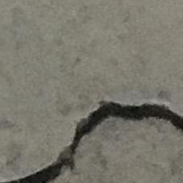
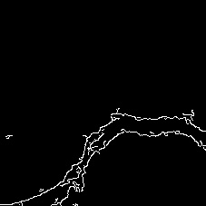
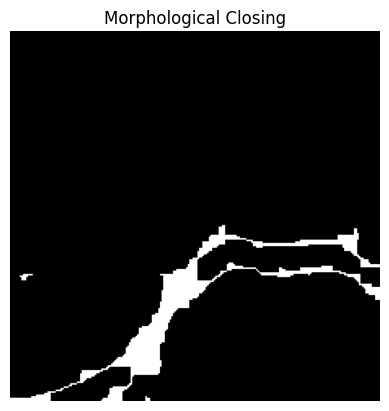
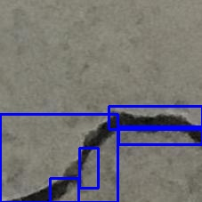
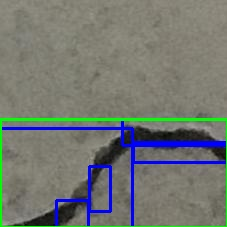
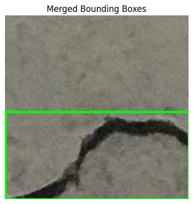
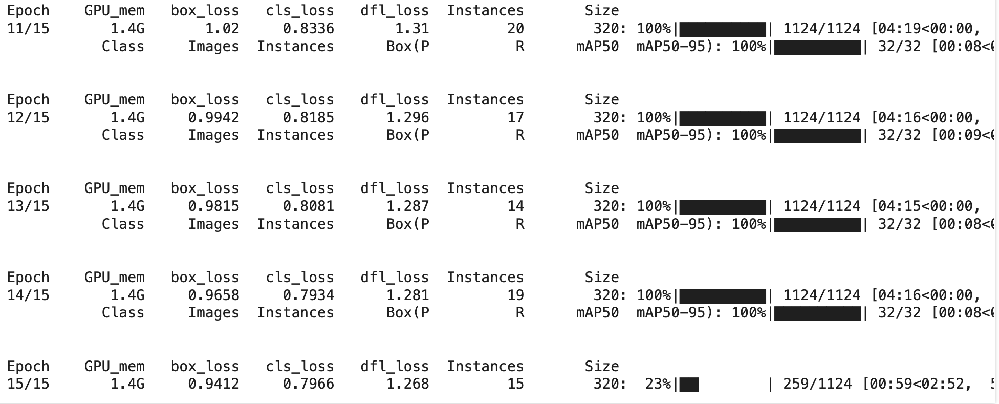
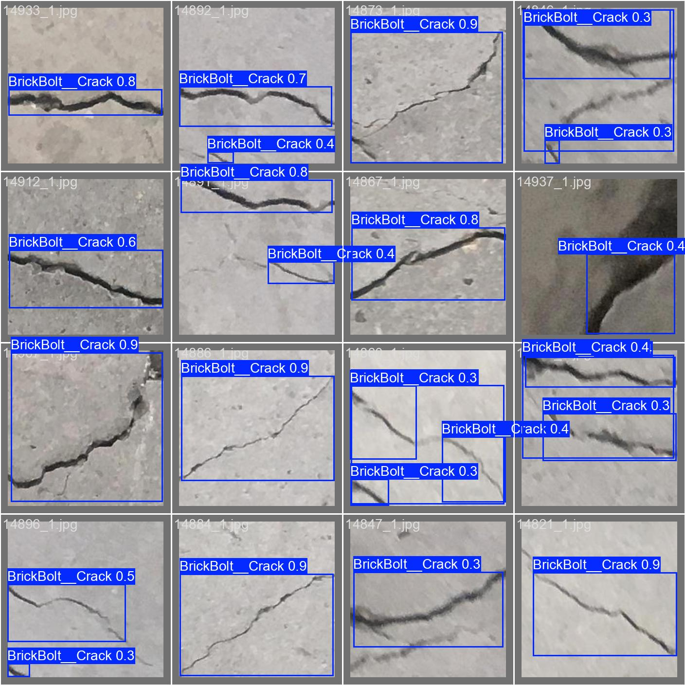

# Crack Detection

## 1. Synthetic Data Generation
Synthetic data is generated using various augmentation techniques to simulate real-world crack patterns. Below are the steps:

1. Load base images  
   *Original Image used as input for annotation generation.*  
   

       
   
  
   
⬇
  
2. Detecting edges  
   *Applying edge detection techniques to highlight crack regions.*  
   

       
   
  
   
⬇
  
3. Morphological Closing  
   *Closing gaps in detected edges to refine crack representation.*  
   

       
   
  
   
⬇
  
4. Bounding Boxes (Before Merging)  
   *Initial bounding boxes before merging overlapping regions.*  
   

       
   
  
   
⬇
  
5. Bounding Boxes (After Merging)  
   *Refined bounding boxes after merging to create a final annotation.*  
   

       
   
  
   
⬇
  
6. Final Bounding Boxes  
   *Finalized bounding boxes ready for training YOLOv12 model.*  
   

       
   
  

## 2. Model Training
A deep learning model is trained using a dataset of crack and non-crack images. The model architecture is based on CNNs (e.g., ResNet, MobileNet).

### Training Steps:
1. Load dataset
2. Apply data augmentations (mosaic,flipping, rotation, brightness adjustment, etc.)
3. Preprocess images (resizing,normalization, and annotation conversion)
4. Train using YOLOv12 with pre-trained weights
5. Validate model on test dataset and compute performance metrics
6. Fine-tune hyperparameters to optimize accuracy
7. Save trained YOLOv12 model

    

## Training Results
The best results obtained during training are shown in the table below:

| Epoch | Time (s) | Train Box Loss | Train Cls Loss | Train DFL Loss | Precision (B) | Recall (B) | mAP50 (B) | mAP50-95 (B) | Val Box Loss | Val Cls Loss | Val DFL Loss |
|-------|---------|---------------|---------------|---------------|--------------|-----------|-----------|-------------|--------------|--------------|--------------|
| 6     | 1712.26 | 1.11759       | 0.94894       | 1.36727       | 0.88584      | 0.86468   | 0.91809   | 0.84357     | 1.18579      | 0.91302      | 1.11045      |

## 4. Test Results
The model was tested on unseen data, and the best performance metrics are shown below:

| Precision | Recall | mAP50 | mAP50-95 |
|-----------|--------|-------|----------|
| 0.89234   | 0.87123 | 0.92145 | 0.85678 |

## 4. Image Detections
The trained model is used to detect cracks in new images. Below are sample detections.

EOL

echo "README.md has been successfully created!"
